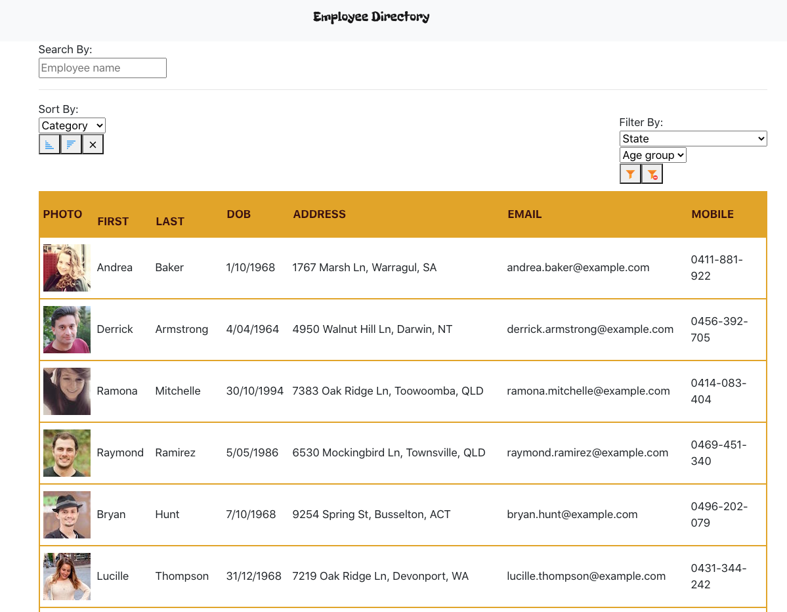
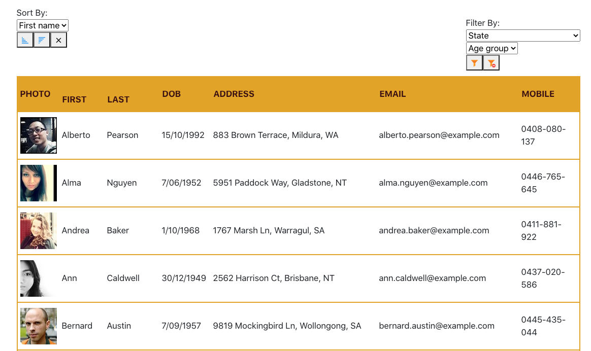
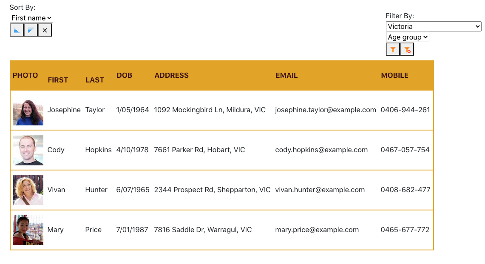
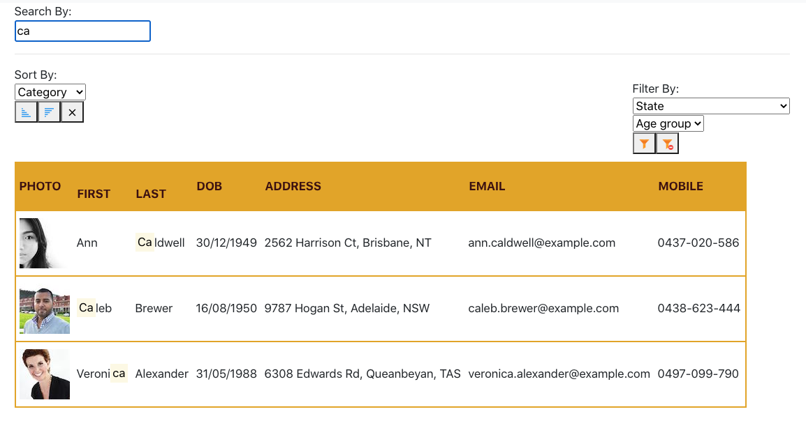

# Employee-Directory

This application allows the user to view the entire employee directory and have a quick access the their basic information.
Users are able to sort the table bur First Name, Last Name or by employees age. It can also be filtered by the State or State and age group. Moreover, there is a search area if the user has a specific employee in mind.

[Deployed Application]("https://criscel.github.io/employee-directory/")

## Usage
[Landing Page](Assets/images/landing.PNG) 
 
[First Name Sorted](Assets/images/sorted.PNG) 
 
[State Filtered](Assets/images/filtered.PNG) 
 
[Search Box](Assets/images/search.PNG) 
 

